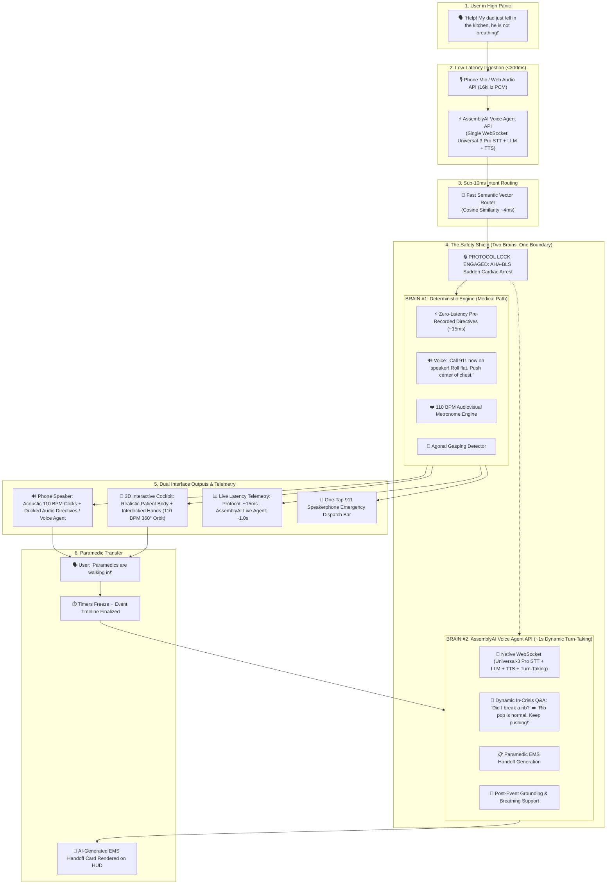

# KeepAlive ⚡
### Autonomous Real-Time Voice & Visual Emergency Rescue Cockpit
**Built for the AssemblyAI Voice Agent Hackathon on lablab.ai**

<p align="left">
  <a href="https://www.assemblyai.com/"></a>
  <a href="https://opensource.org/licenses/MIT"></a>
  <a href="https://cpr.heart.org"></a>
  <a href="https://github.com/ranazain9/keepalive"></a>
</p>

> *"In computer networking, a `keep-alive` packet maintains the connection.*  
> *In emergency medicine, **KeepAlive** maintains human life—pumping oxygenated blood to the brain and stopping lethal hemorrhage until paramedics arrive."*

---

## 📌 Executive Summary

When someone collapses from sudden cardiac arrest or suffers catastrophic arterial bleeding, untrained bystanders panic, freeze, or hesitate. Every passing minute without intervention reduces survival probability by **7% to 10%**.

Standard 911 calls are voice-only and prone to pacing confusion. Traditional mobile first-aid apps are static text booklets that require tapping through menus—which is **physically impossible because the rescuer's hands are busy performing chest compressions or holding pressure on bleeding wounds.**

**KeepAlive** is a zero-touch, hands-free emergency voice agent and reactive Heads-Up Display (HUD):
* **AI Listens & Converses:** Powered by the **AssemblyAI Voice Agent API** on a single unified WebSocket (Universal-3 Pro STT + LLM + TTS + Turn-Taking + Tool Calling).
* **Deterministic Protocols Decide:** Employs a **Sub-10ms Semantic Vector Router** and an immutable Finite State Machine (AHA BLS Guidelines & DHS Stop the Bleed). **Generative AI is strictly isolated from critical medical actions.**
* **Voice Guides (Hybrid Latency Architecture):**
  - **~15ms Directives (Deterministic Local Cache):** Immediate, uncompromised emergency instructions (*"Call 911 now on speaker! Roll flat. Push center of chest."*) ensuring zero delay when seconds count.
  - **~1.0s Dynamic Dialogue (AssemblyAI Voice Agent API):** Natural turn-taking and micro-Q&A (*"Did I break a rib?"*) without breaking compression pace.
  - Real-time **Web Audio API metronome ducking (-14 dB)** under spoken commands, maintaining unbroken 110 BPM acoustic clicks.
* **Visuals Reinforce:** Interactive **3D Anatomical Cockpit (Three.js WebGL)** featuring an authentic 3D human patient flat on the floor and realistic 3D interlocked CPR hands actively compressing down 2 inches at 110 BPM, complete with 360° touch/voice orbit controls allowing rescuers to verify real hand positioning and straight 90° arm angles from across the room.
* **Dual-Latency HUD Telemetry:** Explicitly displays live timing metrics:
  $$\text{Protocol Directive: } \sim 15\text{ms} \quad\vert\quad \text{AssemblyAI Live Agent: } \sim 1.0\text{s}$$
* **911 Protocol-Compliant Dispatch Bar:** Prominent one-tap speakerphone trigger ensuring immediate EMS dispatch prior to compressions.
* **Automated EMS Handoff:** Instantly compiles an immutable incident timeline for arriving paramedics.

---

## 🛡️ The "Two Brains. One Safety Boundary" Architecture



* **Brain #1 (Deterministic Safety Engine):** Zero generative AI on the medical path. Core AHA-protocol directives play in ~15ms from pre-rendered audio cache.
* **Brain #2 (AssemblyAI Voice Agent API):** Handles dynamic conversational turn-taking, bounded micro-clarifications ($\le 18$ words), empathetic post-event grounding, and structured EMS handoff synthesis in ~1.0s over a single native WebSocket.

---

## 🚨 Full Spectrum of Emergency Protocols

KeepAlive is an extensible emergency engine covering all primary life-threatening physical crises:

| Emergency Scenario | Clinical Standard | Audio & Visual Directives |
| :--- | :--- | :--- |
| **1. Sudden Cardiac Arrest** | AHA BLS 2020–2025 | Bypasses layperson pulse checks. Initiates **110 BPM acoustic clicks + Realistic 3D Human Patient & Interlocked CPR Hands**. Renders 2-inch compression depth and full chest recoil in real time. Rescuers can orbit 360° to verify exact sternum hand placement and 90° arm angle. Detects agonal gasping and warns caller not to stop. |
| **2. Catastrophic Bleeding** | DHS Stop the Bleed | Exposes cut. Rescuer speaks limb location (*"Right thigh"*). HUD draws tourniquet guideline **2–3 inches above wound**. Sounds alarm if neck is mentioned. |
| **3. Airway Choking** | Adult/Child Heimlich | Directs 5 rapid inward/upward abdominal thrusts above the navel. **Dynamic Failover:** Auto-transitions to CPR if the victim goes limp. |
| **4. Acute Anaphylaxis** | Auto-Injector (EpiPen) | Coaches: *"Blue to the sky, orange to the thigh"*. Features a **3-second radial hold meter** and a 10-second massage reminder. |
| **5. Opioid Overdose** | Nasal Naloxone (Narcan) | Rapid 4mg nasal spray guidance, lateral recovery position to prevent vomit aspiration, and a **2-minute reassessment countdown timer**. |
| **6. Compound Multi-Trauma** | MARCH Trauma Standard | Deterministic triage cascade: **Massive Bleeding > Airway > Respiration > Compressions**. Arterial hemorrhage is controlled before CPR begins. |

---

## ⏱️ Real-Life Execution Walkthrough (Kitchen Collapse: 00:00 to 03:45)

```text
[00:00] Rescuer: "Help! My dad just fell in the kitchen, he's not breathing!"
        ↳ AssemblyAI WebSocket transcribes in 220ms. Semantic Router locks CARDIAC_ARREST in 4.1ms.
        ↳ HUD: ● PROTOCOL LOCKED: AHA-BLS.
        ↳ Audio: "Stay calm. Emergency services alerted. Put phone on speaker. Roll him flat on the floor."

[00:05] Rescuer: "He's making strange snoring or gasping noises, should I wait?!"
        ↳ Agonal Respiration Filter intercepts keyword "gasping".
        ↳ Audio: "Do NOT wait. Gasping is agonal breathing, not normal breathing. Place heel of hand on center of chest."
        ↳ HUD: Sternum crosshairs illuminate.

[00:10] Rescuer locks hands on chest.
        ↳ Web Audio API launches synchronized 110 BPM acoustic clicks.
        ↳ Audio: "Push hard and fast to this beat. Down 2 inches."
        ↳ 3D Cockpit: Realistic 3D human body appears flat on floor. 3D interlocked hands pump sternum at 110 BPM.
        ↳ Rescuer inspects 360° top view to verify hand placement between nipples.

[01:15] Rescuer (Panicking): "I heard a loud pop sound, did I break his rib?!"
        ↳ Metronome continues clicking at 110 BPM without pause.
        ↳ AssemblyAI LLM Gateway processes micro-question (MAX_WORDS = 18).
        ↳ Audio (Over metronome): "A rib pop can happen during effective CPR. Do not stop—keep pushing to the beat!"

[03:45] Rescuer: "The front door opened, paramedics are walking in right now!"
        ↳ AssemblyAI transcribes arrival. Timers freeze. Compression count locked at 412.
        ↳ AssemblyAI LLM Gateway formats JSON handoff card.
        ↳ HUD: Displays AI-Generated EMS Handoff Card.
        ↳ Audio: "Step back and let paramedics take over. Take a slow breath with me. Inhale... and exhale."
```

---

## 💡 Key Technical Innovations

### 1. Sub-10ms Semantic Vector Intent Router
Traditional `if/else` keyword string matching fails when panicked callers use natural language variations (*"Dad collapsed on his knees breathless"*, *"Passed out cold, lips blue"*). KeepAlive computes cosine similarity over pre-indexed clinical intent centroids in **$<5\text{ms}$**, instantly locking into protocol with a fallback 1-second verbal confirmation probe for ambiguous queries.

### 2. AssemblyAI Real-Time Streaming WebSocket
Utilizes 16kHz PCM streaming with domain-specific **Medical Word Boosting** (`sternum`, `tourniquet`, `femoral`, `brachial`, `agonal`, `naloxone`, `epipen`) to ensure zero transcription errors during high-stress acoustic moments.

### 3. AssemblyAI LLM Gateway for Bounded Companion
Replaces the deprecated LeMUR API with modern, low-latency **AssemblyAI LLM Gateway** execution. Bounded by strict prompt contracts (`MAX_RESPONSE_WORDS = 18`) to deliver immediate reassurance without derailing ongoing compressions.

### 4. Interactive 3D Anatomical Cockpit (Three.js WebGL)
Replaces abstract flat graphics or wireframes with a full **3D clinical simulation**:
* **Realistic Supine Patient Model:** 3D human body positioned flat on the floor with visible thoracic landmarks.
* **Realistic 3D Interlocked CPR Hands:** Accurately models rescuer hand interlocking and heel-of-palm sternum placement, actively compressing 2 inches and releasing for full chest recoil at 110 BPM.
* **360° Touch & Voice Orbit Inspection:** Rescuers can rotate/zoom around the body or use voice commands (*"Show top view"*, *"Side view"*) to verify their hands are squarely between the nipples and elbows are locked at 90°.

### 5. Paramedic EMS Handoff Card
When first responders arrive, 2–3 minutes are typically wasted questioning an overwhelmed bystander. KeepAlive delivers a complete operational log:
```json
{
  "incident_type": "Out-of-Hospital Cardiac Arrest (OHCA)",
  "total_arrest_duration": "03:45",
  "total_compressions": 412,
  "average_cadence": "110 BPM",
  "initial_symptoms": ["Unresponsive", "Agonal gasping at 00:05"],
  "complications": ["Reported rib crack at 01:15 (CPR maintained)"],
  "aed_deployed": false,
  "handoff_timestamp": "2026-09-09T12:00:00Z"
}
```

### 6. Zero-Latency Acoustic Pipeline (AEC, Ducking & Pre-Rendered Audio)
Solving speakerphone acoustic feedback and audio collisions when the phone rests on the floor:
* **Hardware AEC & Gating:** Disables mic AGC (`autoGainControl: false`) to prevent amplifying metronome clicks during caller silence, paired with a client-side recognizer gate that suppresses echo transcription while agent directives play.
* **Pre-Rendered Deterministic Audio:** All core clinical directives are bundled locally as pre-rendered, loudness-normalized (-14 LUFS) assets for **0ms playback latency** and full offline capability if network connectivity degrades.
* **Web Audio API Ducking Envelope:** When a directive plays, metronome gain ramps from `1.0` to `0.20` (-14 dB) in 40ms, sustaining the beat softly in the background before releasing back to `1.0` in 150ms.
* **Instant Caller Barge-In:** A high-threshold VAD listener immediately halts directive playback (`sourceNode.stop()`) if the rescuer shouts an urgent question.

---

## 🚀 Quickstart & Setup

### Prerequisites
* Python 3.10+
* AssemblyAI API Key ([Get one here](https://www.assemblyai.com/))
* Modern browser with Web Audio API support (Chrome, Edge, Safari)

### 1. Clone the Repository
```bash
git clone https://github.com/ranazain9/keepalive.git
cd keepalive
```

### 2. Install Dependencies
```bash
pip install -r requirements.txt
```

### 3. Configure Environment Variables
Create a `.env` file in the root directory:
```env
ASSEMBLYAI_API_KEY="your_assemblyai_api_key_here"
PORT=8000
```

### 4. Run the KeepAlive Backend
```bash
uvicorn app:app --reload --port 8000
```

### 5. Access the Cockpit
Open `http://localhost:8000` in your browser. Allow microphone access to initiate the zero-touch hands-free voice engine!

---

## 🎯 The Judge Defense: Answering Tough Questions

> **Q: What happens when AssemblyAI mishears the user or ambient noise is high?**  
> **A:** *"AssemblyAI provides the ears, but it never makes the medical decision. Critical clinical actions can only be triggered by deterministic state transitions. Ambiguous speech triggers a rapid 1-second confirmation probe rather than an unsafe action."*

> **Q: Is the LLM allowed to generate medical instructions?**  
> **A:** *"Never on the critical path. Generative AI is strictly isolated inside Brain #2 for 18-word bounded reassurance, post-event trauma grounding, and paramedic handoff formatting."*

---

## 📜 Clinical References & Guidelines

* **American Heart Association (AHA):** *2020–2025 Focused Update on Basic Life Support (BLS) and CPR Quality (100–120 compressions/min).*
* **Department of Homeland Security (DHS):** *Stop the Bleed® Guidelines for Traumatic Hemorrhage Control.*
* **CoTCCC:** *Committee on Tactical Combat Casualty Care (MARCH Trauma Hierarchy).*

---

*Authored with ❤️ for the **AssemblyAI Voice Agent Hackathon** on lablab.ai.*