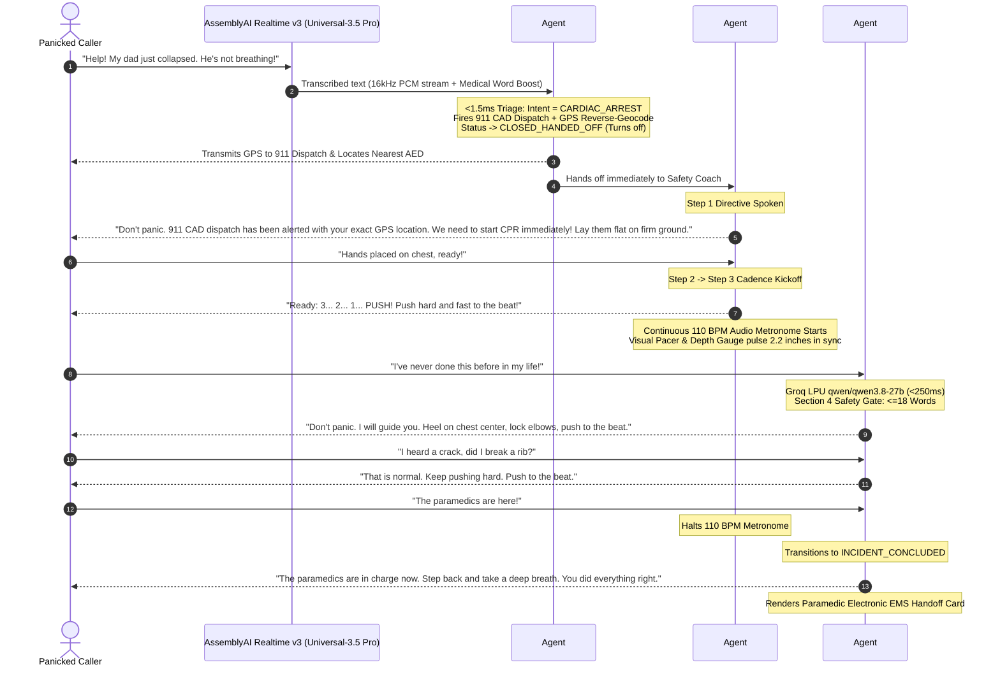

# KeepAlive ⚡
### Autonomous Real-Time Voice & Visual Emergency Rescue Cockpit
**Built for the AssemblyAI Voice Agent Hackathon on lablab.ai**

<p align="left">
  <a href="https://keepalive-dpt7.onrender.com"></a>
  <a href="https://www.assemblyai.com/"></a>
  <a href="LICENSE"></a>
  <a href="https://cpr.heart.org"></a>
  <a href="https://groq.com/"></a>
  <a href="https://github.com/ranazain9/keepalive"></a>
</p>

> 🚑 **Live Production Cockpit:** **[https://keepalive-dpt7.onrender.com](https://keepalive-dpt7.onrender.com)**  
> *"In computer networking, a `keep-alive` packet maintains the connection.*  
> *In emergency medicine, **KeepAlive** maintains human life—pumping oxygenated blood to the brain and controlling lethal hemorrhage until paramedics arrive."*

---

## 📌 Executive Summary

When someone collapses from sudden cardiac arrest or catastrophic trauma, bystanders panic, freeze, or hesitate. Every passing minute without CPR reduces survival probability by **7% to 10%**.

Standard 911 calls are voice-only and prone to pacing confusion. First-aid mobile apps are static text booklets that require tapping through menus—which is **physically impossible because the rescuer's hands are busy performing chest compressions or holding pressure on bleeding wounds.**

**KeepAlive** is a zero-touch, hands-free emergency voice cockpit engineered with a specialized **3-Agent Resuscitation Architecture**:
1. **Agent #1 (Triage & CAD Dispatcher - Sub-1.5ms):** Classifies trauma & cardiac arrest in milliseconds, locks the clinical protocol, fires autonomous 911 CAD dispatch with live GPS, locates physical AEDs, and immediately hands off/closes to eliminate speech clashing.
2. **Agent #2 (Safety Coach & 110 BPM Metronome - Sub-0.5ms):** Authoritative physical commands (AHA 2025 BLS Guidelines) with continuous Web Audio synthetic 110 BPM metronome clicks, synchronized anatomical manikin sternum displacement, and 2-minute fatigue swap alerts.
3. **Agent #3 (Clinical Companion & Groq LPU Doctor - ~200ms):** Answers rescuer panic doubts (*"never done CPR before"*, *"broken ribs"*, *"vomiting"*, *"am I pressing too hard"*) using **Groq LPU (`qwen/qwen3.8-27b`)** with a compassionate human doctor persona. Enforces Section 4 Clinical Safety Rules ($\le 18$ words, zero delay, never halting compressions) with instant sub-3ms offline fallback.

---

## 🏗️ 3-Agent Resuscitation Architecture



---

## ⚡ Agent Specifications & Latency Matrix

| Dimension | Agent #1: Triage & CAD | Agent #2: Safety Coach | Agent #3: Groq LPU LLM | Agent #3: Offline Reflex |
| :--- | :--- | :--- | :--- | :--- |
| **Role** | Hazard triage & 911 dispatch | AHA protocol & 110 BPM clicks | Human doctor emotional coach | Sub-3ms zero-freeze safety net |
| **Technology** | Inverted Index / MARCH Algorithm | Deterministic BLS State Machine | Groq LPU (`qwen/qwen3.8-27b`) | Inverted Regex Panic Database |
| **Latency (P50)** | **1.10 ms** | **0.16 ms** | **~200 ms** | **3.08 ms** |
| **Latency (P99)** | **2.43 ms** | **0.42 ms** | **~295 ms** | **4.40 ms** |
| **Clinical Standard** | MARCH Trauma Protocol | AHA 2025 BLS Guidelines | Section 4 Cognitive Safety Gate | AHA / ERC Pediatric & Adult |
| **Internet Required?** | 100% Offline Capable | 100% Offline Capable | Yes (Groq API) | 100% Offline Capable |
| **Lifecycle State** | `ACTIVE` $\to$ `CLOSED_HANDED_OFF` | `STANDBY` $\to$ `ACTIVE_STEP_1..3` | `STANDBY` $\to$ `ACTIVE_GROQ_LLM` | Standby safety net |

---

## 🖥️ System Components

### 1. Rescue Cockpit (Frontend - React + Vite)
* **Real-Time Voice Streaming:** Captures microphone audio, downsamples to 16 kHz Int16 PCM, and streams over bi-directional WebSockets (`/ws/triage`).
* **Web Audio Metronome Engine:** Generates sample-accurate 3000 Hz ducked sine clicks at 110 BPM with zero garbage collection or timer drift.
* **Resuscitation Pacing Hero:** Visual pacer with real-time compression depth indicator (target: 2.0"–2.4"), compression counter, elapsed time, and video/anatomical guidance.
* **Live Telemetry & Diagnostics:** Live telemetry HUD tracking pipeline latency, word velocity (WPM), audio RMS energy, and agent state transitions.
* **Electronic EMS Handoff Modal:** Real-time paramedic transition card recording total compressions, time-on-chest, clinical timeline, and GPS coordinates for first responders.

### 2. Orchestration Backend (Python 3.13 / FastAPI)
* **AssemblyAI Real-Time WebSocket v3 Bridge:** Low-latency streaming transcription with Medical Emergency Word Boosting (`sternum`, `tourniquet`, `femoral`, `agonal`, `compressions`, `defibrillator`, `narcan`).
* **Fast-Reflex Interim Speech Triggers:** Immediate protocol escalation on life-threatening interim phrases without waiting for silence timeouts.
* **Acoustic Echo Filter:** Suppresses echo of agent speech during playback to prevent feedback loops while preserving barge-in interruptions.
* **CAD Dispatcher & AED Radar:** Instant simulated CAD dispatch with reverse-geocoded address lookup and Overpass API emergency AED locator.

---

## 🛡️ Clinical Directives & Protocol Flows

### 1. Sudden Cardiac Arrest (AHA 2025 BLS Standard)
* **Step 1 (Emergency Services & Immediate Action):**
  > *"Don't panic. 911 CAD dispatch has been alerted with your exact GPS location. We need to start CPR immediately! Lay them flat on firm ground."*
* **Step 2 (Posture & Hand Placement):**
  > *"Put heel of hand on center of chest, lock your elbows straight."*
* **Step 3 (Compressions Cadence & Metronome):**
  > *"Ready: 3... 2... 1... PUSH! Push hard and fast to the beat! Push down two inches, let the chest rise fully every time."* $\to$ *(Continuous 110 BPM Metronome Audio)*

### 2. Live Panic Micro-Q&A (Human Doctor Persona $\le 18$ Words)
* **Novice Rescuer:** *"I don't know CPR, I've never done this!"*  
  $\to$ *"Don't panic. I will guide you. Heel on chest center, lock elbows, push to the beat."* (15 words)
* **Cracking Ribs:** *"I heard a loud pop, did I break a rib?!"*  
  $\to$ *"That is normal. Keep pushing hard. Push to the beat."* (9 words)
* **Vomiting Airway:** *"He is throwing up, what do I do?"*  
  $\to$ *"Roll him on his side. Let it drain. Flip him back. Push to the beat."* (13 words)
* **Fatigue / Exhaustion:** *"My arms are burning, I can't push anymore!"*  
  $\to$ *"Use your upper body weight. If someone is nearby, swap without stopping. Push to the beat."* (15 words)
* **Paramedic Arrival:** *"The paramedics are here!"*  
  $\to$ *"The paramedics are in charge now. Step back and take a deep breath. You did everything right."* (17 words)

---

## 💻 Tech Stack

* **Streaming Speech-to-Text:** [AssemblyAI Realtime Streaming v3](https://www.assemblyai.com/) (`wss://streaming.assemblyai.com/v3/ws`) using **Universal-3.5 Pro** with Medical Emergency Word Boosting.
* **Conversational Resuscitation Intelligence:** [Groq LPU](https://groq.com/) running `qwen/qwen3.8-27b` (~200ms latency).
* **Backend Framework:** FastAPI / Uvicorn (Python 3.13).
* **Frontend Framework:** React 19, Vite, Vanilla CSS design tokens.
* **Auditory Cadence:** Web Audio API generating synthetic 3000 Hz ducked sine clicks at 110 BPM.
* **Geolocation & Infrastructure:** Reverse-geocoded live GPS coordinates + OpenStreetMap Overpass AED radar.
* **Safety Gating:** Section 4 Clinical Safety Gate with hard-filters against halting compressions.

---

## 📂 Repository Structure

```
keepalive/
├── client/                     # Next-Gen React + Vite Rescue Cockpit
│   ├── src/
│   │   ├── components/         # CAD Banner, Pacing Hero, Companion, EMS Card
│   │   ├── hooks/              # useMetronome, useRescueState, useRescueVoice
│   │   ├── App.jsx             # Main cockpit controller
│   │   └── index.css           # High-contrast clinical theme
│   └── package.json
├── server/                     # Multi-Agent Python FastAPI Service
│   ├── agents/
│   │   ├── triage/             # Agent #1: MARCH trauma classification
│   │   ├── safety_coach/       # Agent #2: AHA 2025 BLS state machine
│   │   └── companion/          # Agent #3: Groq LLM & Micro-Q&A engine
│   ├── api/routes/             # REST & WebSocket endpoints (/ws/triage)
│   ├── core/                   # Configuration, logging, event bus
│   ├── schemas/                # Pydantic schemas & clinical data models
│   ├── services/               # Rescue orchestrator coordinator
│   ├── tests/                  # 60 automated unit & benchmark tests
│   └── main.py                 # FastAPI application entrypoint
├── client_test.html            # Standalone browser testing suite
├── requirements.txt            # Python dependencies
├── LICENSE                     # MIT License
└── README.md
```

---

## 🚀 Quickstart

### 🌐 Live Hosted Deployment
The production application is deployed and live on Render:  
👉 **[https://keepalive-dpt7.onrender.com](https://keepalive-dpt7.onrender.com)**  
*(Native WebSocket audio streaming, 3-agent orchestration, 3-way theme switcher, and 110 BPM metronome engine).*

### Local Prerequisites
* Python 3.10+ (Tested on Python 3.13)
* Node.js 18+ & npm
* AssemblyAI API Key ([Get one free](https://www.assemblyai.com/))
* Optional: Groq API Key ([Groq Console](https://console.groq.com/))

### 1. Clone the Repository
```bash
git clone https://github.com/ranazain9/keepalive.git
cd keepalive
```

### 2. Configure Environment Variables
Copy `.env.example` to `.env`:
```env
ASSEMBLYAI_API_KEY=your_assemblyai_api_key_here
GROQ_API_KEY=your_groq_api_key_here
CAD_PROVIDER=MOCK
PORT=8000
```

### 3. Setup and Start Backend
```bash
pip install -r requirements.txt
py -3.13 -m uvicorn server.main:app --host 127.0.0.1 --port 8000 --reload
```

### 4. Setup and Start Frontend Cockpit
In a new terminal:
```bash
cd client
npm install
npm run dev
```
Open **`http://localhost:5173`** (or `http://127.0.0.1:8000`) in your browser. Click the microphone button to start real-time hands-free emergency resuscitation assistance!

### 5. Run Automated Tests
```bash
py -3.13 -m unittest discover -s server/tests -p "test_*.py"
```
*(All 60 tests execute and pass in ~2 seconds with sub-2ms benchmarks).*

---

## 📜 Clinical Guidelines & Governance
* **American Heart Association (AHA):** *2020–2025 Focused Update on Basic Life Support (BLS) and CPR Quality (100–120 compressions/min).*
* **Department of Homeland Security (DHS):** *Stop the Bleed® Guidelines for Traumatic Hemorrhage Control.*
* **CoTCCC:** *Committee on Tactical Combat Casualty Care (MARCH Trauma Hierarchy).*
* **Federal Good Samaritan Legislation:** *42 U.S. Code § 238q (Protection for emergency bystander resuscitation).*

## ⚖️ Media & Asset Attribution
* **Clinical CPR Video:** Open clinical emergency resuscitation demonstration (`cpr_demonstration.mp4`) calibrated to 110 BPM pacing for educational bystander guidance.
* **Icons:** [Lucide Icons](https://lucide.dev/) (ISC License).
* **Typography:** Google Fonts (`Outfit`, `JetBrains Mono` under SIL Open Font License).
* **Zero Proprietary 3D Assets:** All proprietary and third-party 3D models were fully purged from the repository to maintain 100% pure MIT open-source licensing integrity.

---

## 📄 License

This project is licensed under the MIT License - see the [LICENSE](LICENSE) file for details.

---

*Authored with ❤️ for the **AssemblyAI Voice Agent Hackathon** on lablab.ai.*