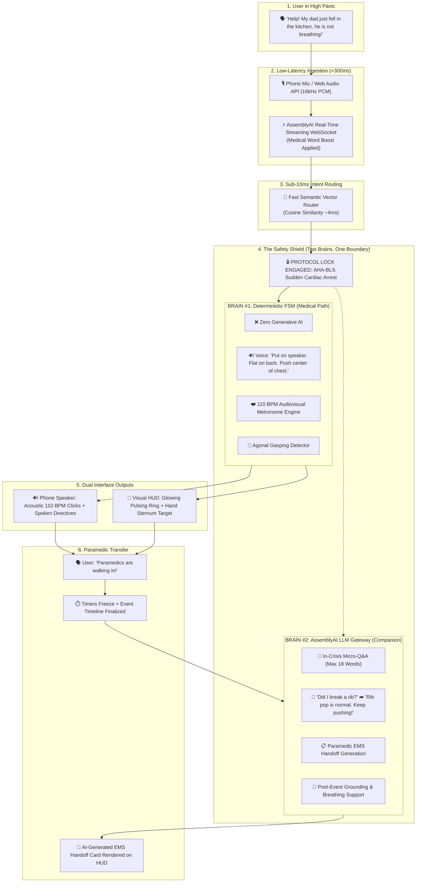

# KeepAlive: Real-Time Voice & Visual Autonomous Emergency Rescue Cockpit
## Comprehensive System Design Specification (Final 9.6/10 Champion Edition)

---

## 1. Executive Summary & Core Mission

### 1.1 Project Title
**KeepAlive** (with *KeepAlive Companion*) — *The Autonomous Real-Time Voice & Visual Emergency First-Responder*

### 1.2 The Core Philosophy
> **"AI listens. Deterministic protocols decide. Voice guides. Visuals reinforce."**

* In computer science and WebSockets (like AssemblyAI's real-time streaming), a `keep-alive` packet maintains the connection.
* In emergency medicine, **KeepAlive** maintains the human connection—pumping oxygenated blood to the brain and controlling hemorrhage until paramedics arrive.

In sudden cardiac arrest, traumatic bleeding, choking, anaphylaxis, or overdose, every passing second without intervention causes irreversible tissue necrosis or brain death. Untrained bystanders frequently panic, freeze, or hesitate. Standard 911 phone calls are voice-only and prone to confusion, while mobile first-aid apps are static text booklets that require tapping through menus—which is physically impossible because the rescuer's hands are busy doing chest compressions or holding bleeding wounds.

**KeepAlive** bridges this survival gap with a zero-touch emergency rescue interface:
1. **Zero-Touch Speech Streaming:** Powered by **AssemblyAI Real-Time WebSocket Streaming**, capturing user speech in under 300 milliseconds with specialized medical word boosting.
2. **Sub-10ms Semantic Vector Intent Router:** Cosine similarity classification replacing brittle if-else string matching, instantly locking to the right emergency protocol in <5ms.
3. **Synchronized 110 BPM Visual HUD:** A flight-instrument style cockpit featuring an illuminated **110 BPM pulsing heart ring** and clean anatomical targets visible from 6 to 10 feet away.
4. **Protocol-Locked Deterministic Execution:** Generative AI is **strictly isolated from the safety-critical execution path**. All emergency steps follow an immutable Finite State Machine (FSM) aligned with American Heart Association (AHA) and DHS "Stop the Bleed" guidelines.
5. **KeepAlive Companion (Bounded In-Crisis Q&A & Post-Event Grounding):** Powered by **AssemblyAI LLM Gateway**, providing bounded 18-word micro-clarifications during CPR and empathetic grounding after first responders arrive.
6. **AI-Generated EMS Handoff Summary:** Automatically compiling the second-by-second incident timeline into an instant handoff card for arriving paramedics.

---

## 2. The Real-World Hands-Occupied Survival Gap

* **The Perfusion Window:** In cardiac arrest, every minute without effective chest compressions reduces survival probability by 7–10%. Continuous bystander CPR maintains cerebral and myocardial perfusion until a defibrillator arrives.
* **The Bleed-Out Clock:** A severed femoral or brachial artery can result in fatal hypovolemic shock in under 3 minutes without immediate direct pressure or tourniquet application.
* **Hands-Occupied Reality:** Rescuers performing two-handed chest compressions or holding direct wound pressure physically cannot hold a phone, unlock a screen, or scroll through apps. **Voice is genuinely the only viable interface.**
* **The Paramedic Information Void:** When paramedics arrive, 2 to 3 critical minutes are wasted gathering chaotic verbal recollections. KeepAlive bridges this gap with an automated, second-by-second event log.

---

## 3. The Safety Shield Architecture

### 3.1 "Two Brains. One Safety Boundary."



* **The Critical Medical Path (STT ➡️ Semantic Router ➡️ FSM ➡️ HUD/Audio):** Generative AI is completely removed from clinical decisions. Medical actions are 100% deterministic, zero-hallucination, and protocol-locked.
* **The Bounded Conversational Path (AssemblyAI LLM Gateway):** Restricted to whitelisted clarification answers (`MAX_RESPONSE_WORDS = 18`), post-event debriefing, and EMS handoff compilation.

### 3.2 Sub-10ms Semantic Vector Intent Router (Replacing Brittle If-Else)
In sudden emergencies, callers never speak uniform sentences. One caller screams: *"My dad fell on his knees in the kitchen and isn't breathing!"* while another cries: *"Unconscious, blue face, no pulse!"*
* **Why Traditional If-Else Fails:** Keyword matching (`if "not breathing" in text:`) breaks when callers use natural variations (*"gasping for air"*, *"chest not moving"*, *"passed out cold"*).
* **The Solution — Semantic Vector Routing:** 
  1. We pre-compute embedding centroids for approved clinical intent classes (`CARDIAC_ARREST`, `ARTERIAL_BLEED`, `CHOKING`, `ANAPHYLAXIS`, `OVERDOSE`).
  2. The incoming AssemblyAI real-time partial transcript is converted into a vector and matched via **Cosine Similarity in <5ms**.
  3. If similarity score $\ge 0.82$, the deterministic protocol locks immediately.
  4. If ambiguity exists ($0.60 \le \text{score} < 0.82$), the voice agent executes a single 1-second clarifying probe (*"Is he breathing normally, yes or no?"*).

---

## 4. Full Spectrum of Handled Emergency Situations

KeepAlive is an extensible acute emergency response engine covering the full physiological spectrum of life-threatening trauma:

### 4.1 Flagship Hero: Sudden Cardiac Arrest (AHA BLS 2020–2025 Guidelines)
* **Cadence & Depth:** Continuous 110 BPM audiovisual cadence sitting squarely within the AHA-recommended 100–120 compressions/minute range, targeting 2 to 2.4 inches (5 to 6 cm) depth.
* **Elimination of Layperson Pulse Checks:** Untrained bystanders waste 1–2 critical minutes failing to locate a carotid pulse. KeepAlive bypasses pulse checks: unresponsiveness + absent/abnormal breathing triggers immediate compressions.
* **Synchronized Audiovisual Pacing:**
  * **Audio:** Sharp, non-fatiguing 110 BPM acoustic clicks.
  * **Visual HUD:** Large illuminated heart pulsing at 110 BPM with sternum crosshairs.
* **Agonal Respiration Filter:** Detects descriptions of gasping or snoring sounds and immediately warns: *"Do NOT stop. Gasping is agonal breathing, not normal breathing. Keep pushing to the beat."*

### 4.2 Hero Extensibility: Catastrophic Arterial Bleeding (DHS "Stop the Bleed")
* **Step 1: Exposure:** Directs rescuer to cut or rip away clothing to expose the exact cutaneous bleeding point rather than compressing soaked fabric.
* **Step 2: Speech-Driven Wound Localization:** Rescuer says: *"Right thigh"* or *"Left arm"*. AssemblyAI transcribes in <300ms.
* **Step 3: Dynamic Tourniquet Placement Map:** HUD highlights that limb in pulsing red and renders the horizontal tourniquet guideline **2 to 3 inches above the wound** (closer to the trunk, avoiding joints).
* **Step 4: Neck Tourniquet Safety Interceptor:** If the rescuer mentions a neck laceration, the safety engine sounds an alarm: *"⚠️ NEVER apply a tourniquet around the neck! Apply direct two-handed cloth pressure only."*

### 4.3 Severe Airway Obstruction (Choking / Heimlich Maneuver)
* **Rapid Triage:** Checks: *"Can they speak, cough, or make sound?"* (If yes, encourages forceful coughing without interference).
* **Execution:** If silent choking (hands clutching throat), directs 5 rapid subdiaphragmatic inward/upward abdominal thrusts above the navel.
* **Dynamic Transition to CPR:** If victim becomes limp or unresponsive, the system immediately switches state to Cardiac Arrest CPR without needing a restart.

### 4.4 Acute Anaphylaxis (EpiPen / Auto-Injector Guidance)
* **Symptoms Detected:** Severe allergic reaction, facial/lip swelling, hives, audible stridor/wheezing.
* **Execution Directives:** *"Blue to the sky, orange to the thigh"*, firm perpendicular outer thigh strike through clothing.
* **Visual Hold Countdown:** 3-second radial hold meter on screen with audio count: *"1... 2... 3... Remove and massage for 10 seconds."*

### 4.5 Opioid & Narcotic Overdose (Nasal Naloxone / Narcan)
* **Symptoms Detected:** Pinpoint pupils, pale/blue lips, deep unresponsiveness, respiratory depression.
* **Administration:** Rapid guidance for 4mg nasal Narcan spray into nostril with thumb plunger strike.
* **Recovery & Assessment:** Directs lateral recovery position to prevent aspiration from vomiting, engaging a 2-minute timer for a second dose if breathing remains depressed.

### 4.6 Compound Multi-Trauma Triage Engine (The MARCH Protocol)
When an emergency involves multiple simultaneous injuries (e.g., arterial blood spurting + patient unresponsive and not breathing):
* **Clinical Triage Standard (MARCH):**
  1. **M**assive Bleeding (Arterial spurting kills within 3 minutes).
  2. **A**irway (Clear obstruction).
  3. **R**espiration (Agonal breathing intercept).
  4. **C**irculation (110 BPM chest compressions).
* **Deterministic Priority Cascade:** KeepAlive directs: *"First, apply direct pressure or tourniquet to the thigh wound, then immediately start chest compressions."* AssemblyAI LLM Gateway function calling validates multi-symptom extraction without delaying immediate verbal execution.

---

## 5. KeepAlive Companion: Bounded Intelligence Layer

### 5.1 In-Crisis Micro-Clarifications (`MAX_RESPONSE_WORDS = 18`)
During active CPR, rescuers experience panic-driven hesitations. KeepAlive Companion answers from an approved emergency FAQ in 1 short sentence without pausing the 110 BPM metronome:
* **Q:** *"Can I do CPR on his soft bed?"*
  * **A:** *"Move him to a firm floor if you can do so safely. Then keep pushing."*
* **Q:** *"I heard a bone pop, did I break his rib?!"*
  * **A:** *"A rib injury can happen during effective CPR. Do not stop—keep pushing to the beat."*
* **Q:** *"He vomited, what should I do?!"*
  * **A:** *"Roll him on his side, clear his mouth, roll him back and immediately resume compressions."*
* **Unapproved / Arbitrary Questions:** Fallback to safe instruction: *"Continue chest compressions to the beat. Emergency services will guide further."*

### 5.2 Post-Event Grounding (The Human Touch)
When the rescuer announces *"Paramedics are here!"*, the HUD renders the EMS Handoff Card and initiates empathetic grounding:
* *"The emergency is now being handled by professionals. Take a slow breath with me. Breathe in... and out. You did what you could to help."*
* Prompts to log the responding EMS unit and offers to contact family members.

---

## 6. The Real-Life Clinical Flow: Kitchen Collapse (00:00 to 03:45)

| Timeline | Rescuer Speech / State | Internal System Pipeline | KeepAlive HUD Audio & Visual Response |
| :--- | :--- | :--- | :--- |
| **00:00** | *"Help! My dad just fell in the kitchen, he's not breathing!"* | • Phone streams 16kHz PCM audio.<br/>• AssemblyAI WebSocket transcribes in **220ms**.<br/>• Semantic Router locks `CARDIAC_ARREST` in **4.1ms**. | **Screen:** Cockpit locks to `● PROTOCOL LOCKED: AHA-BLS`.<br/>**Audio:** *"Stay calm. Emergency services alerted. Put phone on speaker. Roll him flat on the floor."* |
| **00:05** | *"He's making strange snoring or gasping noises, should I wait?!"* | • AssemblyAI detects `"gasping"` / `"snoring"`.<br/>• Agonal Respiration Filter intercepts immediately. | **Audio:** *"Do NOT wait. Gasping is agonal breathing, not normal breathing. Place heel of hand on center of chest."*<br/>**Screen:** Sternum crosshairs illuminate. |
| **00:10** | Hands placed on sternum. | • FSM transitions to `ACTIVE_COMPRESSIONS`.<br/>• Web Audio API initiates synchronized 110 BPM engine. | **Audio:** 110 BPM acoustic metronome clicks begin: *"Push hard and fast to this beat. Down 2 inches."*<br/>**Screen:** Pulsing red heart ring expands/contracts at 110 BPM. |
| **01:15** | *"I heard a loud pop sound, did I break his rib?!"* | • Metronome runs continuously without pausing.<br/>• AssemblyAI LLM Gateway parses micro-question (`MAX_WORDS = 18`). | **Audio (over metronome):** *"A rib pop can happen during effective CPR. Do not stop—keep pushing to the beat!"* |
| **03:45** | *"The front door opened, paramedics are walking in right now!"* | • AssemblyAI transcribes `"paramedics are here"`.<br/>• Timers freeze. Compression counter logs 412 total.<br/>• AssemblyAI LLM Gateway formats JSON handoff card. | **Screen:** Displays **AI-Generated EMS Handoff Card**.<br/>**Audio:** *"Step back and let paramedics take over. Take a slow, deep breath with me. Breathe in... and out."* |

---

## 7. The 4 Killer Features That Win

### 7.1 🔒 Visible "Protocol Locked" Indicator
A prominent badge at the top of the HUD: **`● PROTOCOL LOCKED: AHA-BLS`** with active step tracking (**`CARDIAC ARREST • STEP 3 / 5`**). Proves that medical execution is strictly deterministic.

### 7.2 ⏱️ Live Immutable Rescue Timeline
A second-by-second operational log:
```text
━━━━━━━━━━━━━━━━━━━━━━━━━━━━━━━━━━━━━
KEEPALIVE EVENT LOG
09:41:02 — Emergency detected (Cardiac Arrest)
09:41:08 — CPR Protocol Engaged
09:41:15 — Compressions Active (110 BPM)
09:42:10 — Bounded Q&A: Rib injury reassurance provided
09:45:17 — EMS Arrival Triggered (412 Compressions Delivered)
━━━━━━━━━━━━━━━━━━━━━━━━━━━━━━━━━━━━━
```

### 7.3 🚨 Deterministic Panic Mode
Triggered by measurable acoustic signals (speech rate, repeated utterances, volume/energy, transcription fragmentation). The HUD strips away all secondary text and transforms into a high-visibility flight instrument:
```text
                 ❤️
             PUSH NOW
         ●  ●  ●  ●  ●
             110 BPM
```

### 7.4 🚑 AI-Generated EMS Handoff Card (Review with Arriving EMS)
Powered by **AssemblyAI LLM Gateway**, generating the structured summary in 2 seconds upon EMS arrival. Distinguishes immutable system timestamps from AI-summarized clinical handoff notes.

---

## 8. 2.5-Minute Pitch Video Blueprint (The 9.6/10 Storyboard)

| Timecode | Visual Scene | Audio & Dialogue | Storytelling Objective |
|---|---|---|---|
| **0:00 – 0:15** | Black screen: *"Your hands are busy saving a life. Why does emergency software require your hands?"* Cut to simulated collapse. | Sudden thud, dramatic silence. | **Fear & The Hook:** Proves voice-first is mandatory. |
| **0:15 – 0:35** | Rescuer shouts: *"Help! He collapsed, he's not breathing!"* Screen flashes **`CARDIAC ARREST DETECTED`**. | KeepAlive Voice: *"Kneel beside his chest. Lock elbows."* | **Control:** Demonstrates sub-second AssemblyAI STT. |
| **0:35 – 1:10** | Sternum target lights up. 110 BPM glowing heart ring pulses with synchronized audio clicks. Rescuer compresses to the beat. | Audio clicks at 110 BPM. KeepAlive: *"Push down 2 inches. 1, 2, 3, 4."* | **The Money Shot:** Audiovisual CPR pacing matching AHA guidelines. |
| **1:10 – 1:25** | Actor panics: *"I heard a bone pop, did I break his rib?!"* KeepAlive delivers bounded 12-word response without stopping metronome. | KeepAlive: *"A rib injury can happen during effective CPR. Do not stop—keep pushing."* | **Trust:** Bounded in-crisis micro-Q&A in action. |
| **1:25 – 1:35** | Flash **8-second architecture slide**: *Speech ➡️ AssemblyAI STT ➡️ Deterministic FSM ➡️ HUD*. 🔒 *LLM ≠ Medical Decision*. | Narrator: *"The language model never decides the medical action. Protocols are locked in deterministic code."* | **Safety:** Disarms all hallucination concerns in 8 seconds. |
| **1:35 – 1:55** | Fast 15s switch to Bleeding: User shouts *"Right thigh!"* ➡️ Dynamic tourniquet line appears 2 inches above wound. | KeepAlive: *"Wrap tourniquet 2 inches above the cut. Never place on knee."* | **Extensibility:** Proves multi-emergency engine. |
| **1:55 – 2:15** | Rescuer shouts: *"Paramedics are here!"* Timers freeze. Screen shows **AI-Generated EMS Handoff** and initiates grounding. | KeepAlive: *"Paramedics on scene. Take a slow breath with me. You did what you could to help."* | **Continuity & Humanity:** EMS handoff + post-event grounding. |
| **2:15 – 2:30** | Final Logo: *KeepAlive — When seconds count, your hands should save a life, not hold a phone.* | Narrator: *"In networking, keep-alive maintains the connection. In emergencies, KeepAlive maintains human life."* | **The Winning Punchline:** Unforgettable finish. |

---

*Authored for the AssemblyAI Voice Agent Hackathon (lablab.ai) — KeepAlive Project Team.*
